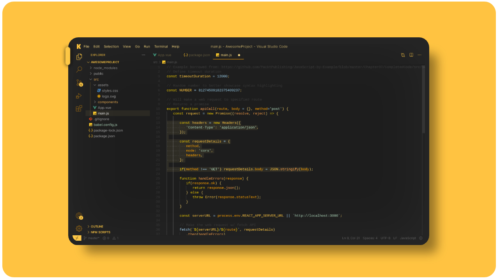

# [Kaplan Dark](https://marketplace.visualstudio.com/items?itemName=Abyadando.kaplan-dark-theme)

  

[Kaplan Dark](https://marketplace.visualstudio.com/items?itemName=Abyadando.kaplan-dark-theme) is a visually striking theme for Visual Studio Code, designed to enhance your coding experience with its dark gray and yellow color scheme. The combination of dark gray background and vibrant yellow accents creates a captivating atmosphere that is both elegant and modern.

## Features

- Dark gray background for reduced eye strain and improved focus.
- Vibrant yellow accents (#ffc640) to highlight important elements.
- Clear visibility of the yellow cursor against the dark background.
- Quick identification of selected text and find matches with the yellow selection background and find match highlight background.

## Installation

1. Launch Visual Studio Code.
2. Go to the Extensions view by clicking on the square icon in the left sidebar or by pressing `Ctrl+Shift+X`.
3. Search for "Kaplan Dark" and click on the "Install" button.
4. Once installed, click on the gear icon and select "Kaplan Dark" from the Color Theme dropdown menu.

## Feedback and Contributions

Your feedback is highly appreciated! If you encounter any issues or have suggestions for improvement, please feel free to open an issue [here](https://github.com/abyadando/kaplan-theme-vscode/issues/new).

Contributions are also welcome! If you would like to contribute to the theme by adding new features or improving existing ones, please submit a pull request.

## Credits

Kaplan Dark was created and is maintained by [abyadando ♘](https://github.com/abyadando).

    
        Thank you for choosing the <code>Kaplan Dark</code> theme to make your coding experience shine brighter than a supernova! May your bugs be minor, your code be elegant, and your coffee always be strong. Keep calm and code on, my friend! Remember, if all else fails, blame it on the monkeys typing away on our keyboards. Happy coding and may the   Kaplan's debugging force be with you!
    
   

